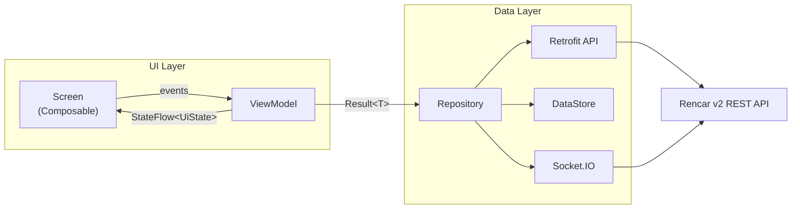
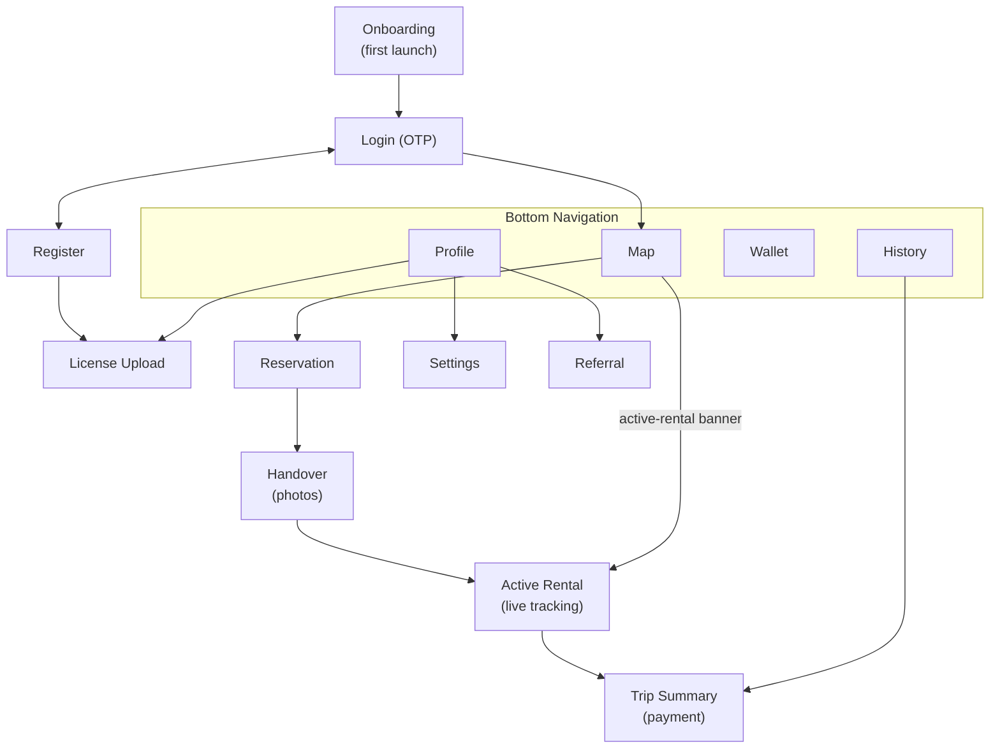
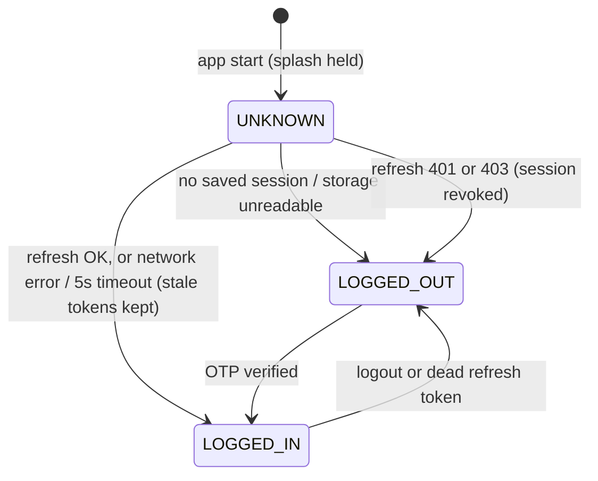
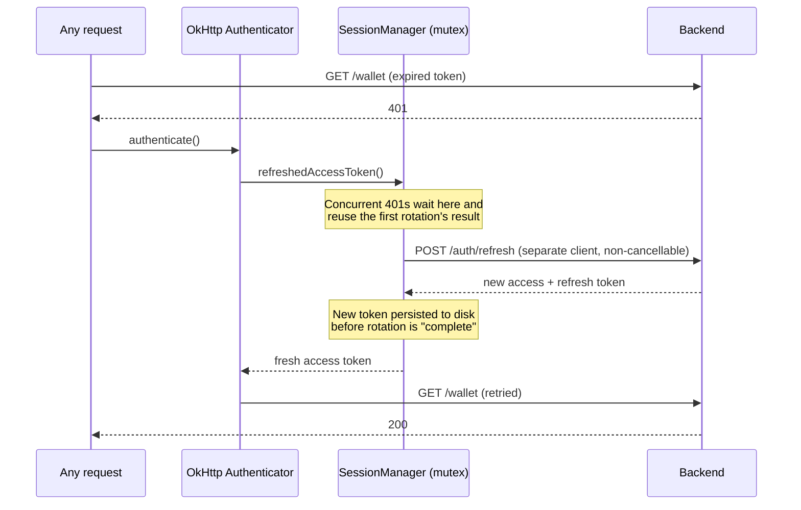

<h1 align="center">Rencar</h1>

<p align="center">
  A modern car-sharing and rental experience for Android — passwordless sign-in, live vehicle tracking, usage-based billing, and in-app payments.
</p>

<p align="center">
  
  
  
  
  
  
</p>

---

## Table of Contents

- [Overview](#overview)
- [Features](#features)
- [Tech Stack](#tech-stack)
- [Architecture](#architecture)
- [App Flow](#app-flow)
- [Session and Token Lifecycle](#session-and-token-lifecycle)
- [Getting Started](#getting-started)
- [Backend API](#backend-api)
- [Development](#development)
- [Roadmap](#roadmap)
- [Acknowledgments](#acknowledgments)

## Overview

Rencar lets users sign in with nothing but a phone number and an SMS code, find nearby vehicles on a live map, reserve or start per-minute rentals, follow their vehicle in real time during a trip, and settle payments through an in-app wallet, saved cards, or Iyzico checkout.

Beyond the product surface, the codebase emphasizes production-grade fundamentals:

- **Resilient session management** — rotating refresh tokens with reuse detection are handled with a single-flight, non-cancellable, persist-before-complete rotation pipeline
- **Transparent auth recovery** — expired access tokens are refreshed and requests retried inside the HTTP layer; screens never see a spurious 401
- **Localization-ready UI** — every user-facing string lives in resources; ViewModels expose `@StringRes` ids, never raw text
- **Single source of truth for design** — spacing, radii, and sizes come from one token file; colors and typography from the theme

<!--
## Screenshots

| Onboarding | Map | Vehicle Detail | Active Rental | Wallet |
| --- | --- | --- | --- | --- |
|  |  |  |  |  |

Add screenshots under docs/screenshots/ and uncomment this section.
-->

## Features

| Area | Highlights |
| --- | --- |
| Authentication | Passwordless OTP login with auto-verify on the last digit, registration with driver's license photos and verification selfie, referral codes, persistent sessions with silent token refresh |
| Map | MapLibre map with distance-aware marker clustering, dark-theme styling, Nominatim location search, vehicle detail sheet, active-rental banner |
| Rentals | Reservations and per-minute rentals, vehicle handover with photo documentation, live vehicle position over Socket.IO, trip summary, rental history with payment follow-up |
| Payments | Wallet with top-up and transaction history, saved card management, Iyzico checkout form plus non-3DS and 3DS card flows |
| Experience | Three-page onboarding on first launch, light/dark/system themes, splash-gated session restore, localization-ready string resources |

## Tech Stack

| Layer | Technology |
| --- | --- |
| Language | Kotlin 2.2 |
| UI | Jetpack Compose, Material 3 |
| Architecture | MVVM, `StateFlow` unidirectional state |
| Navigation | Navigation Compose, type-safe serializable routes |
| Networking | Retrofit 2.11, OkHttp 4.12, kotlinx.serialization |
| Real-time | Socket.IO client |
| Maps and location | MapLibre SDK, Play Services Location, Nominatim geocoding |
| Persistence | Jetpack DataStore (Preferences) |
| Images | Coil |
| Build | Gradle version catalogs, AGP 9.1 |

## Architecture

MVVM with a pragmatic twist: no DI framework — cross-cutting concerns live in small, well-bounded singleton objects (`NetworkModule`, `SessionManager`, `ThemeController`), which keeps the project easy to navigate at its current size while leaving a clean seam for Hilt if the module count grows.



Every screen package is a self-contained triple — a stateless `*Screen` composable, a `*ViewModel` exposing a single `StateFlow<UiState>`, and an immutable `*UiState` data class. Repositories wrap the Retrofit APIs and return Kotlin `Result` values; no exceptions cross the layer boundary.

<details>
<summary><strong>Package layout</strong></summary>

```
com.flowbytestudio.rencar
├── data                  # One package per domain
│   ├── auth              #   AuthApi, AuthSession, SessionManager, TokenStorage
│   ├── cards             #   Saved card CRUD
│   ├── geocoding         #   Nominatim search client
│   ├── iyzico            #   Iyzico checkout flows
│   ├── license           #   License upload and status
│   ├── network           #   Retrofit/OkHttp setup, authenticator, error parsing
│   ├── rentals           #   Rentals, stats, live location (Socket.IO)
│   ├── reservations      #   Reservation lifecycle
│   ├── settings          #   Theme and onboarding preferences
│   ├── vehicles          #   Vehicle listing
│   └── wallet            #   Balance, top-up, transactions
├── navigation            # Type-safe routes, nav graph, bottom bar
└── ui
    ├── common            # Error mapping, input limits, camera, money helpers
    ├── screens           # One package per screen: Screen + ViewModel + UiState
    └── theme             # Colors, typography, design tokens (Dimens)
```

</details>

### Conventions

| Convention | Where | What it does |
| --- | --- | --- |
| Error mapping | `ui/common/ErrorMapping.kt` | One `Throwable.toErrorRes(fallback, overrides)` extension; screens declare only the status codes that carry screen-specific meaning |
| String resources | `res/values/strings.xml` | ViewModels carry `@StringRes` ids, text resolves in the UI layer; adding a language is one `values-<locale>` folder |
| Design tokens | `ui/theme/Dimens.kt` | Spacing scale, corner radii, icon sizes, and control heights managed in one place |
| Field limits | `ui/common/AuthLimits.kt` | Phone/OTP/password lengths and the resend timer, mirroring the backend contract |

## App Flow



## Session and Token Lifecycle

The backend issues short-lived access tokens (~15 min) and rotating refresh tokens (~7 days) with **reuse detection**: presenting an already-used refresh token revokes the entire session family. The client is designed around that contract.

### App launch



### Expired access token, transparent recovery



### Failure-mode guarantees

| Risk | Countermeasure |
| --- | --- |
| Two parallel refreshes trip reuse detection | All rotations serialized through one mutex; waiters reuse the fresh token without a network call |
| Cancelled request loses the rotated token | Refresh runs `NonCancellable`; the response is always consumed and applied |
| Process dies before the new token is saved | Token pair is written to DataStore before the mutex is released |
| Refresh deadlocks behind requests waiting on it | Refresh uses a dedicated OkHttp client outside the per-host connection limit |
| Corrupt token file crash-loops the app | DataStore corruption handler resets storage; the user simply signs in again |
| Logout races an in-flight refresh | Stale results are discarded if the session changed while the request was in flight |

## Getting Started

| Requirement | Version |
| --- | --- |
| Android Studio | Latest stable |
| JDK | 11 |
| Android SDK | 36 |
| API keys | None needed |

```bash
git clone https://github.com/ertekinbatuhan/turkcell-gygy-5-kotlin-rencar-app.git
cd turkcell-gygy-5-kotlin-rencar-app
./gradlew :app:assembleDebug
```

## Backend API

| Resource | Location |
| --- | --- |
| Base URL | `https://rencarv2.halitkalayci.com/` |
| Interactive docs | `https://rencarv2.halitkalayci.com/api/docs` |
| OpenAPI spec | `https://rencarv2.halitkalayci.com/api/openapi.json` (snapshot in `docs/api-openapi_v2.json`) |
| Live vehicle positions | Socket.IO namespace `/ws/locations`, authenticated with the customer access token |

## Development

- Commit messages follow the [Conventional Commits](https://www.conventionalcommits.org/) style (`feat:`, `fix:`, `refactor:`, `docs:`), which keeps the history reviewable and changelog-friendly.
- Contributor and agent guidelines — including the API contract notes and repository coding rules — are documented in [agents.md](agents.md).
- Work lands on `development` and reaches `main` through pull requests.

## Roadmap

- [ ] English localization (`values-en/strings.xml`) on top of the completed string-resource migration
- [ ] Typography tokens: migrate remaining `sp` literals to Material 3 `Typography` styles
- [ ] Push notifications for reservation and rental state changes
- [ ] UI and unit test coverage for the session/token pipeline and payment flows
- [ ] Hilt adoption if the module count grows beyond the singleton approach

## Acknowledgments

Developed as part of the Turkcell Geleceği Yazan Gençler (GYGY 5.0) Kotlin bootcamp. The Rencar v2 backend API is provided by the course instructor.
